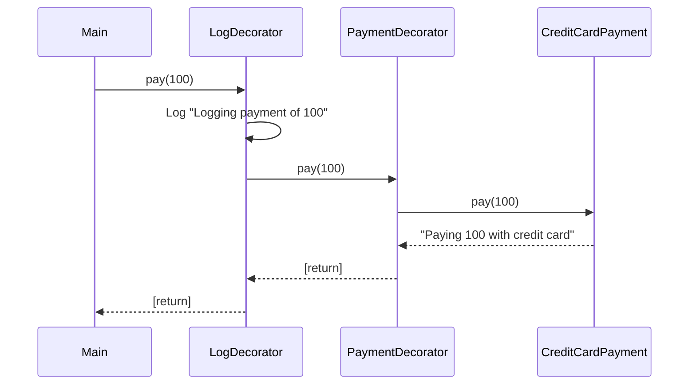
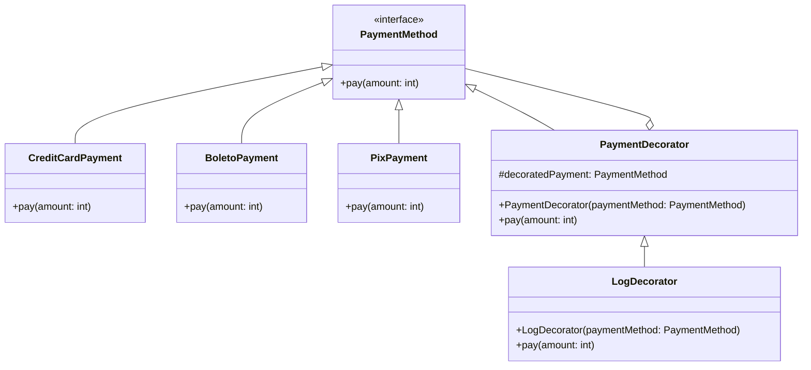

#### Diagrama de Sequência

```mermaid
sequenceDiagram
    participant Main as Main
    participant LogDecorator as LogDecorator
    participant PaymentDecorator as PaymentDecorator
    participant CreditCard as CreditCardPayment

    Main->>LogDecorator: pay(100)
    LogDecorator->>LogDecorator: Log "Logging payment of 100"
    LogDecorator->>PaymentDecorator: pay(100)
    PaymentDecorator->>CreditCard: pay(100)
    CreditCard-->>PaymentDecorator: "Paying 100 with credit card"
    PaymentDecorator-->>LogDecorator: [return]
    LogDecorator-->>Main: [return]
```

#### Diagrama de Classes

```mermaid
classDiagram
    class PaymentMethod {
        <<interface>>
        +pay(amount: int)
    }

    class CreditCardPayment {
        +pay(amount: int)
    }
    class BoletoPayment {
        +pay(amount: int)
    }
    class PixPayment {
        +pay(amount: int)
    }

    class PaymentDecorator {
        #decoratedPayment: PaymentMethod
        +PaymentDecorator(paymentMethod: PaymentMethod)
        +pay(amount: int)
    }

    class LogDecorator {
        +LogDecorator(paymentMethod: PaymentMethod)
        +pay(amount: int)
    }

    PaymentMethod <|-- CreditCardPayment
    PaymentMethod <|-- BoletoPayment
    PaymentMethod <|-- PixPayment
    PaymentMethod <|-- PaymentDecorator
    PaymentDecorator <|-- LogDecorator
    PaymentDecorator o-- PaymentMethod
```